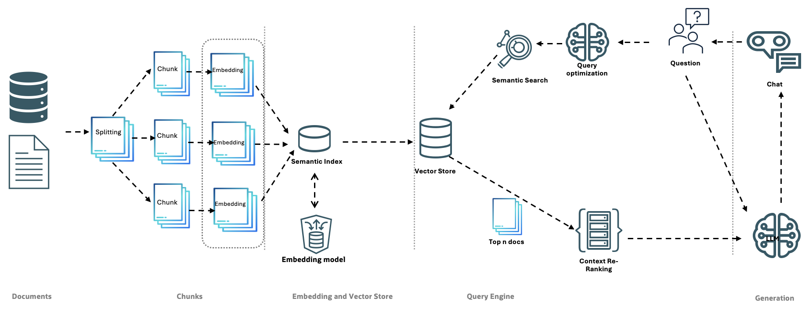

# RAG Application

This is a sophisticated Retrieval-Augmented Generation (RAG) application leveraging FastAPI, OCI GenAI, and Oracle Database 23ai. The application is designed with a modular architecture, emphasizing clean abstractions and separation of concerns.

## Features

- Modular architecture with well-defined interfaces
- Support for multiple chunking strategies (fixed-size and semantic)
- Integration with OCI GenAI for chat model functionality
- Flexible document and domain management
- Customizable query engine with optimization and re-ranking capabilities
- Vector store integration for efficient similarity search

## Architecture Overview

The application is built on a set of abstract interfaces, promoting loose coupling and easier testing. Below is a high-level architecture diagram of the RAG Application:



*Figure 1: High-level architecture diagram of the RAG Application*

The diagram illustrates the main components and workflow of the system:

1. **Documents**: The process begins with raw documents and database entries.

2. **Chunks**: 
   - Documents are split into smaller chunks using the `ChunkStrategyInterface`.
   - These chunks are then processed to create embeddings using the `EmbeddingModelInterface`.

3. **Embedding and Vector Store**:
   - The embeddings are stored in a Semantic Index, implemented via the `VectorStoreInterface`.
   - This process is facilitated by an Embedding model, defined by the `EmbeddingModelInterface`.

4. **Query Engine**:
   - When a question is received, it goes through query optimization (`QueryOptimizerInterface`).
   - The optimized query is used for semantic search in the Vector Store.
   - Top N documents are retrieved and undergo context re-ranking (`ReRankerInterface`).

5. **Generation**:
   - The re-ranked context, along with the original question, is sent to the chat model (`ChatModelInterface`).
   - The chat model generates the final response.

Throughout this process, the `DomainManagerInterface` orchestrates the document and domain management, while the `QueryEngineInterface` handles the core question-answering functionality.

The application uses the following key interfaces:

- `ChatModelInterface`: Handles the final response generation
- `ChunkStrategyInterface`: Manages the document splitting process
- `DocumentInterface` and `DocumentFactoryInterface`: Represent and create document objects
- `DomainInterface` and `DomainFactoryInterface`: Manage domain-specific information
- `DomainManagerInterface`: Orchestrates overall document and domain management
- `EmbeddingModelInterface`: Generates embeddings for chunks and queries
- `QueryEngineInterface`: Coordinates the question-answering process
- `QueryOptimizerInterface`: Optimizes incoming queries
- `ReRankerInterface`: Re-ranks retrieved documents for relevance
- `StorageInterface`: Manages raw document storage and retrieval
- `VectorStoreInterface`: Handles storage and querying of vector embeddings

This architecture ensures a modular and extensible system, where each component can be independently developed, tested, and optimized.

## Requirements

- Python 3.10+
- FastAPI
- OCI GenAI
- Oracle Database 23ai
- Additional dependencies listed in `requirements.txt`

## Setup

1. Clone the repository:
   ```
   git clone https://github.com/yourusername/rag-application.git
   cd rag-application
   ```

2. Create and activate a virtual environment:
   ```
   python -m venv venv
   source venv/bin/activate  # On Windows, use `venv\Scripts\activate`
   ```

3. Install dependencies:
   ```
   pip install -r requirements.txt
   ```

4. Set up your `.env` file with the necessary environment variables (see `.env.example` for reference)

5. Run the application:
   ```
   python src/rag_app/main.py
   ```

## Usage

The application exposes a `/ask` endpoint that accepts POST requests with a question and domain description. Detailed API documentation is available at the `/docs` endpoint when running the application.

## Development

To run tests:
```
pytest tests/
```

To build the Docker image:
```
docker build -t rag-app .
```

## Contributing

Contributions are welcome! Please feel free to submit a Pull Request.

## License

This project is licensed under the MIT License - see the [LICENSE](LICENSE) file for details.


